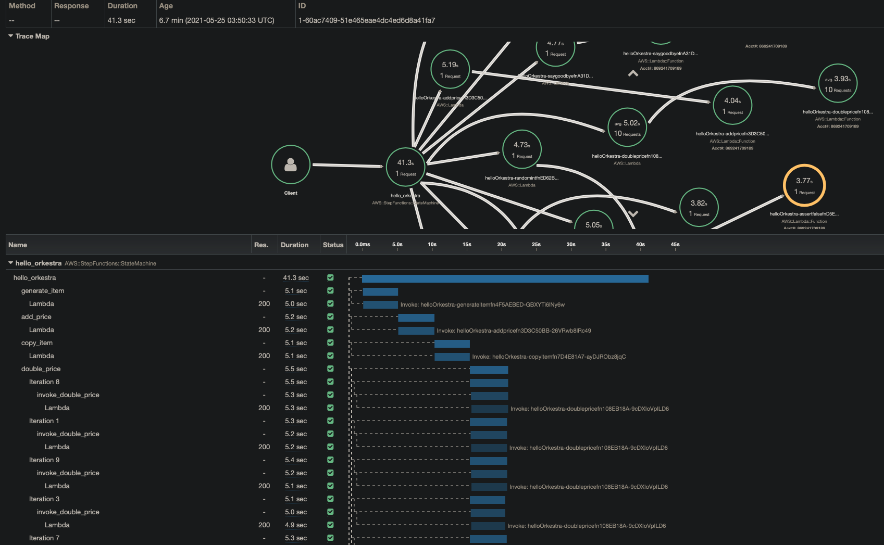

# Orkestra


[](https://knowsuchagency.github.io/orkestra)
[](https://app.codecov.io/gh/knowsuchagency/orkestra/)

[](https://discord.com/channels/846930683872280638/846930684446638102)
[](https://pypi.org/project/orkestra/)


[](https://github.com/kolomied/awesome-cdk)

* *deploy lambdas, compose them into workflows, and trigger them on schedule or from cloud events with ease (at a tiny fraction of the cost of Airflow)*
* *render your diagrams dynamically from code (like Airflow)*
* *no more wondering about the status of your jobs (and how they broke)*
* *no more struggling with the operational maintenance of always-on infrastructure to run your jobs*

## What is Orkestra?

Orkestra is a lightweight abstraction layer on top of

* [AWS Cloud Development Kit (CDK)](https://github.com/aws/aws-cdk)
* [Lambda](https://aws.amazon.com/lambda/)
* [Step Functions](https://aws.amazon.com/step-functions/?step-functions.sort-by=item.additionalFields.postDateTime&step-functions.sort-order=desc)
* [X-Ray](https://aws.amazon.com/xray/)
* [Lambda Powertools](https://awslabs.github.io/aws-lambda-powertools-python/latest/) (optional but recommended)

that provides a seamless way of building observable (scheduled or event-driven) cloud-native workflows.

It aims to bring a similar development experience to that of Airflow while leveraging the full power of AWS.


### Features

* simple intuitive developer experience
* scheduled (ETL) workflows
* event-driven workflows
* simplified local testing
* natively integrated with AWS
* cost-effective
* highly scalable


## Example

=== "Business Logic"

    ```{.py3 hl_lines="12-22"}
    import random
    from typing import *
    from uuid import uuid4

    from aws_lambda_powertools import Logger, Tracer
    from pydantic import BaseModel

    from orkestra import compose
    from orkestra.interfaces import Duration


    def dag():
        (
            generate_item
            >> add_price
            >> copy_item
            >> double_price
            >> (do_nothing, assert_false)
            >> say_hello
            >> [random_int, random_float]
            >> say_goodbye
        )


    class Item(BaseModel):
        id: str
        name: str
        price: Optional[float] = None

        @classmethod
        def random(cls):
            return cls(
                id=str(uuid4()),
                name=random.choice(
                    [
                        "potato",
                        "moon rock",
                        "hat",
                    ]
                ),
            )


    logger = Logger()

    tracer = Tracer()


    default_args = dict(
        enable_powertools=True,
        timeout=Duration.seconds(6),
    )


    @compose(**default_args)
    def generate_item(event, context):
        logger.info("generating random item")
        item = Item.random().dict()
        logger.info(item)
        tracer.put_metadata("GenerateItem", "SUCCESS")
        return item


    @compose(model=Item, **default_args)
    def add_price(item: Item, context):
        price = 3.14
        logger.info(
            "adding price to item",
            extra={
                "item": item.dict(),
                "price": price,
            },
        )
        item.price = price
        return item.dict()


    @compose(model=Item, **default_args)
    def copy_item(item: Item, context) -> list:
        logger.info(item.dict())
        return [item.dict()] * 10


    @compose(model=Item, is_map_job=True, **default_args)
    def double_price(item: Item, context):
        item.price = item.price * 2
        return item.dict()


    @compose(**default_args)
    def assert_false(event, context):
        assert False


    @compose(**default_args)
    def do_nothing(event, context):
        logger.info({"doing": "nothing"})


    @compose(**default_args)
    def say_hello(event, context):
        return "hello, world"


    @compose(**default_args)
    def say_goodbye(event, context):
        return "goodbye"


    @compose(**default_args)
    def random_int(event, context):
        return random.randrange(100)


    @compose(**default_args)
    def random_float(event, context):
        return float(random_int(event, context))


    dag()
    ```

=== "Infrastructure As Code"

    ```python
    from aws_cdk import core as cdk
    from examples.hello_orkestra import generate_item

    class HelloOrkestra(cdk.Stack):
        def __init__(self, scope, id, **kwargs):

            super().__init__(scope, id, **kwargs)

            generate_item.schedule(
                self,
                expression="rate(5 minutes)",
                state_machine_name="hello_orkestra",
            )

    app = cdk.App()

    HelloOrkestra(app, "helloOrkestra")
    ```
=== "Unit Tests"

    ```python
    from dataclasses import dataclass

    import pytest

    from examples.hello_orkestra import (
        generate_item,
        add_price,
        copy_item,
        double_price,
        Item,
        assert_false,
        do_nothing,
        say_hello,
        say_goodbye,
        random_int,
        random_float,
    )


    @pytest.fixture
    def context():
        @dataclass
        class LambdaContext:
            function_name: str = "test"
            memory_limit_in_mb: int = 128
            invoked_function_arn: str = (
                "arn:aws:lambda:eu-west-1:809313241:function:test"
            )
            aws_request_id: str = "52fdfc07-2182-154f-163f-5f0f9a621d72"

        return LambdaContext()


    @pytest.fixture
    def item():
        return Item.random().dict()


    class TestMethods:
        @staticmethod
        def test_generate_item(item, context):
            generated = generate_item(item, context)
            assert Item(**generated)

        @staticmethod
        def test_add_price(item, context):
            result = add_price(item, context)
            assert result["price"]

        @staticmethod
        def test_copy_item(item, context):
            result = copy_item(item, context)
            assert all(i == item for i in result)

        @staticmethod
        def test_double_price(item, context):
            item["price"] = 1
            result = double_price(item, context)
            assert result["price"] == item["price"] * 2

        @staticmethod
        def test_assert_false(item, context):
            with pytest.raises(AssertionError):
                assert_false(item, context)

        @staticmethod
        def test_do_nothing(item, context):
            assert do_nothing(item, context) is None

        @staticmethod
        def test_say_hello(item, context):
            assert say_hello(item, context)

        @staticmethod
        def test_goodbye(item, context):
            assert say_goodbye(item, context)

        @staticmethod
        def test_random_int(item, context):
            result = random_int(item, context)
            assert isinstance(result, int)

        @staticmethod
        def test_random_float(item, context):
            result = random_float(item, context)
            assert isinstance(result, float)
    ```

=== "State Machine Diagram Screenshot"

    

=== "X-Ray Screenshot"

    

=== "CloudWatch Screenshot"

    ```{.py3 hl_lines="4-10"}
    @compose(model=Item, **default_args)
    def add_price(item: Item, context):
        price = 3.14
        logger.info(
            "adding price to item",
            extra={
                "item": item.dict(),
                "price": price,
            },
        )
        item.price = price
        return item.dict()
    ```

    
