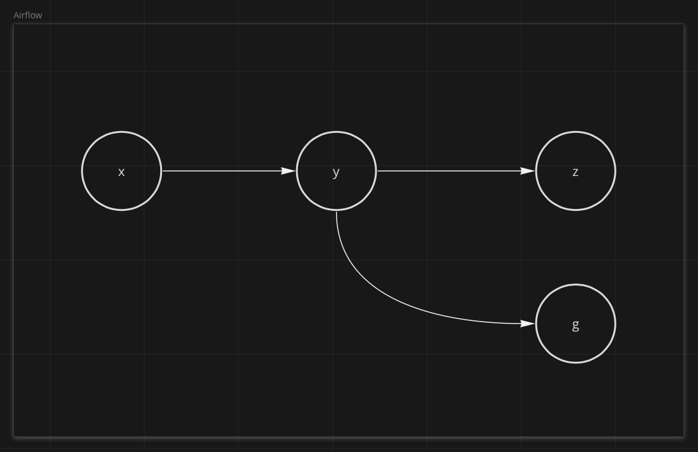
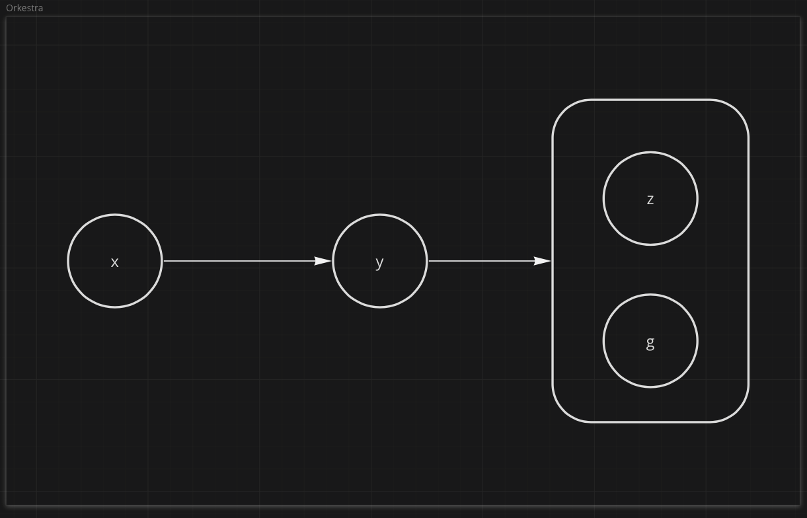

## Powertools

### requirement.txt

If wanting to use [Powertools](https://awslabs.github.io/aws-lambda-powertools-python/latest/) with your lambdas (recommended), make sure to add it to the lambdas' requirements.txt
files as an optional requirement for Orkestra.

=== "lambda_directory/requirements.txt"

    ```
    orkestra[powertools]>=0.4.3
    ```

### timeout

Using Powertools will increase your lambdas' startup time so you will likely
want to increase your lambdas' timeout duration.

=== "lambda_directory/index.py"

    ```python
    from aws_lambda_powertools import Logger

    from orkestra import compose
    from orkestra.interfaces import Duration

    logger = Logger()


    @compose(enable_powertools=True, timeout=Duration.seconds(6))
    def handler(event, context):
        ...
    ```

## Composition

Let's say we had a 3 part workflow `x >> y >> z`.

At some point we needed to add a task that ran immediately after `y`. Let's call it `g`.

`g` runs after `y` but has no effect on `z`.

### Coming from Airflow

If you're coming from Airflow, you would likely add `g` this way:

```python
x >> y >> z

y >> g
```



### Orkestra (Step Functions) Graph

Orkestra is built on top of AWS Step Functions which don't allow arbitrarily appending multiple downstream nodes to any
to a given part of the State Machine graph, like Airflow.

In order to achieve a similar result, you must group tasks together like so:

```python
x >> y >> [z, g]
```



### Errors

The issue we run into is in the event of the failure of `g`.

Step Functions halt at the entire state machine at the time an error is first encountered.

Remember we said `z` doesn't depend on `g`. If `g` fails before `z` finishes execution, the entire State Machine will
halt execution and `z` won't run.

To help address this, Orkestra allows you to compose tasks like so:

```python
# notice we use a tuple vs a list here
x >> y >> (z, g)
```


This will automatically create tasks for each parallel job that "swallow" errors.

`g` will still show up as having failed but the error will be forwarded as part of the output
of the parallel job that contains it.

You can then decide what to do with that error in a downstream consumer, whether to log it and continue execution,
fail the state machine, loop back, etc.
